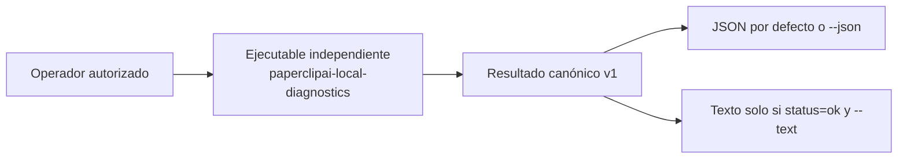

# Informe y manual de operación — CENTRAL Local Diagnostics

Este documento entrega el estado y la operación segura de `paperclipai-local-diagnostics`. Es una herramienta manual y aislada de **provenance de compilación y compatibilidad del runtime del propio diagnóstico**; no administra ni observa CENTRAL.

## Camino rápido

1. Para la ruta normal, confirma el ID de caso, la autorización del propietario humano del sistema y el ID, checksum y provenance del artefacto o distribución autorizados; Teseo solicita y orquesta, y Hefesto ejecuta.
2. Para la ruta de emergencia fuera de banda, el propietario humano lanza manualmente a Optimus solo cuando Hefesto no puede actuar o Paperclip/OpenClaw no está disponible. Confirma autorización del incidente, artefacto accesible autorizado, destino de evidencia y propietario humano de escalación.
3. Ejecuta solo uno de los comandos siguientes; no añadas argumentos posicionales ni otros flags. Conserva stdout y el código de salida como evidencia. Un resultado nunca autoriza una acción sobre CENTRAL.

```bash
paperclipai-local-diagnostics
paperclipai-local-diagnostics --json
paperclipai-local-diagnostics --text
```

Captura segura para adjuntar a un caso:

```bash
paperclipai-local-diagnostics --json > central-local-diagnostics.json
code=$?
printf 'exit_code=%s\n' "$code"
```

`paperclipai-local-diagnostics` existe cuando el paquete `paperclipai` que contiene ese bin está instalado o cuando una distribución ya construida expone su bin. Este cambio **no publicó** un paquete npm ni creó una etiqueta de release; no supongas que el nombre está disponible mediante npm.

## Control documental

| Campo | Valor |
|---|---|
| Versión del manual | 1.2.0 |
| Fecha | 2026-09-06 |
| Fuente Git verificada | `fork/master` `811782130ba42228a5e2ad86f0f3e96e8a47ac3c` |
| Árbol Git verificado | `d5f208c563f5e07487b04e8627d7ea22206fb1b4` |
| Estado del cambio | Integrado, verificado y archivado en Engram (`central-local-diagnostics`) |
| Estado de release | Preparado para distribución pública por configuración; **sin tag ni publicación npm realizada** |
| Audiencia | Propietario humano del sistema, Teseo, Hefesto, Optimus, Atenea, Helios y mantenedor/autoridad de release de Paperclip |
| Propietario documental | Mantenedor y autoridad de release de Paperclip |
| Propietario operativo, accountable y de escalación | Propietario humano del sistema |
| Ejecutor normal elegible | Hefesto, solo por caso explícitamente autorizado y con artefacto distribuido autorizado |
| Ejecutor excepcional de emergencia | Optimus, externo a Paperclip, solo si el propietario humano lo lanza manualmente para el incidente exacto y dispone de artefacto accesible autorizado |

La fuente canónica de esta guía es este archivo del repositorio y es la autoridad procedimental para esta operación. La copia de Engram es índice y espejo de transferencia. La doctrina desplegada de OpenClaw se referencia de forma estable en `deploy/hefesto-helios/doctrine-applied/hefesto/AGENTS.md`; no sustituye este manual ni concede permisos adicionales.

## Informe ejecutivo de situación

Se entregó un ejecutable independiente, `paperclipai-local-diagnostics`, con una salida canónica v1 que comunica:

- provenance embebido del paquete (`version` y `buildCommit`);
- compatibilidad del runtime Node del proceso de diagnóstico;
- checks, límites de alcance y garantías negativas declaradas.

El valor operativo es poder registrar esa evidencia sin iniciar la CLI normal ni el servidor, y sin consultar configuración, estado o salud de CENTRAL. El cambio está integrado y archivado; no hay daemon ni planificador. La ruta normal es Teseo → autorización del propietario humano → Hefesto. La ruta de emergencia fuera de banda es propietario humano → lanzamiento manual de Optimus: Optimus es externo, informa directamente al propietario y no depende de la disponibilidad de Paperclip/OpenClaw.

## Propósito y anti-propósito

| El ejecutable informa | El ejecutable no informa ni realiza |
|---|---|
| Versión y commit de compilación embebidos | Salud, liveness o readiness de CENTRAL |
| Compatibilidad del runtime Node del diagnóstico | Configuración, entorno, archivos, logs o estado de CENTRAL |
| Resultado v1 determinista del proceso aislado | Inicio, activación, reparación, recuperación o cambios |
| Checks y garantías negativas del proceso | Red, base de datos, almacenamiento, proveedor, plugin, worker, scheduler o servidor |

**Prohibición de interpretación:** un `ok` no demuestra que CENTRAL esté instalado, configurado, vivo, listo, accesible ni recuperable. Un resultado no autoriza acciones correctivas.

## Responsabilidad y modelo de asignación

| Actividad | R — Responsible | A — Accountable | C — Consultado | I — Informado |
|---|---|---|---|---|
| Solicitar y orquestar un caso | Teseo | Propietario humano del sistema | Atenea cuando haya consideración de seguridad | Helios |
| Autorizar el caso y ser dueño de escalación | — | Propietario humano del sistema | Atenea cuando haya consideración de seguridad | Teseo, Helios |
| Ejecutar la invocación permitida y preservar evidencia | Hefesto, únicamente para un caso explícitamente autorizado y con artefacto distribuido autorizado | Propietario humano del sistema | Atenea cuando haya consideración de seguridad | Helios; Teseo |
| Ejecutar excepcionalmente en emergencia fuera de banda | Optimus, solo como break-glass para el incidente exacto cuando Hefesto no puede actuar o Paperclip/OpenClaw no está disponible; no es responsable rutinario | Propietario humano del sistema | Atenea cuando haya consideración de seguridad | Teseo, Helios |
| Interpretar el contrato técnico del ejecutable | Mantenedor de Paperclip | Propietario humano del sistema | Atenea cuando haya consideración de seguridad | Teseo, Helios |
| Fuente, build, distribución, provenance, instalación y release de Paperclip | Mantenedor y autoridad de release de Paperclip | Mantenedor y autoridad de release de Paperclip | Propietario humano del sistema; Atenea cuando haya consideración de seguridad | Teseo, Helios |
| Resolver una anomalía o decidir cualquier acción sobre CENTRAL | — | Propietario humano del sistema | Atenea; mantenedor de Paperclip cuando corresponda | Teseo, Helios |

Teseo solicita y orquesta; no ejecuta ni autoriza por defecto. Atenea es consultada para seguridad; no ejecuta ni es aprobador general. Helios solo observa e informa. Optimus es externo a Paperclip, es lanzado manualmente por el propietario humano y reporta directamente a este. El mantenedor y la autoridad de release de Paperclip son una función separada: no son Hefesto ni Optimus y no adquieren ejecución operativa por esta tabla.

## Arquitectura y flujo



**Alternativa textual:** un operador invoca un único ejecutable independiente. Este crea un resultado canónico v1 y lo renderiza como JSON por defecto o como texto únicamente en éxito con `--text`. El flujo no incluye servidor, base de datos, red, configuración, archivos de CENTRAL, procesos auxiliares ni activación.

## Disponibilidad e instalación: distribución autorizada

Que el código fuente esté integrado no significa que un binario distribuible esté disponible. `cli/package.json` declara el bin `paperclipai-local-diagnostics` y `publishConfig.access: public`, pero esta entrega no ejecutó publicación npm ni release.

### Requisitos comprobados

| Requisito | Hecho comprobado | Implicación |
|---|---|---|
| Política de paquete | `engines.node: >=20` | El ejecutable considera compatible un major Node `>=20`. |
| Metadatos embebidos | SemVer válido y SHA hexadecimal de 40 caracteres | Si faltan o son inválidos, termina con error 3. |
| Artefacto | Bin declarado hacia `dist/local-diagnostics.js` | El operador necesita un paquete instalado o un artefacto construido y autorizado. |
| Distribución | No publicada por este cambio | El asignado debe recibir prueba concreta de release/artefacto e instrucciones aprobadas de instalación. |

Antes de autorizar la operación, el caso debe contener: ID de caso, autorización del propietario humano del sistema, ID y origen del artefacto, checksum y provenance, versión, commit de build de 40 caracteres si aplica, destino de evidencia aprobado y propietario humano de escalación. En la ruta de emergencia, debe añadir el motivo concreto de break-glass y confirmar que Optimus dispone de un artefacto autorizado accesible. Que Optimus sea externo no implica que el ejecutable, el host, el runtime o el artefacto estén disponibles ni que se puedan sortear controles de sistema operativo o acceso. El mantenedor y la autoridad de release de Paperclip gestionan fuente, build, distribución, provenance, instalación y release; Hefesto y Optimus no los realizan. Si falta la distribución o cualquiera de sus datos de identificación, marca la disponibilidad como **[POR VERIFICAR]**; no intentes instalar, publicar ni construir por iniciativa propia.

### Ruta de build para mantenimiento (no es el camino del operador)

El único escritor de `cli/dist` es `cli/build.mjs`. El código permite al mantenedor autorizado construir desde el repositorio con provenance explícito:

```bash
PC_BUILD_COMMIT=SHA_GIT_DE_40_CARACTERES node cli/build.mjs
```

El valor debe ser hexadecimal minúsculo de 40 caracteres para la ruta de empaquetado validada. Esta orden no es una instrucción de publicación ni una garantía de que el entorno tenga sus dependencias preparadas. La publicación permanece en un flujo de release separado y autorizado.

## Contrato de invocación

| Forma | Aceptada | Salida esperada |
|---|---|---|
| Sin argumentos | Sí; equivale a JSON | Un resultado JSON |
| `--json` | Sí | Un resultado JSON |
| `--text` | Sí, solo para `ok` | Proyección textual del resultado |
| Argumento posicional | No | JSON de `invalid_arguments`, salida 2 |
| Flag desconocido, repetido o combinado | No | JSON de `invalid_arguments`, salida 2 |

No uses `--help`: no forma parte del contrato del ejecutable. No uses opciones de la CLI normal de Paperclip; son otro producto y pueden tener capacidades que este ejecutable no tiene.

## Contrato de salida

### Reglas de transporte

- stdout contiene exactamente un resultado completo y no incluye logs, progreso ni mezcla de formatos.
- JSON es la forma canónica y termina en salto de línea. El campo interno `exitCode` **no** se serializa.
- Para los mismos metadatos embebidos y hechos de runtime, los bytes JSON y las líneas de texto son deterministas.
- Incluso si se pide `--text`, cualquier resultado distinto de `ok` permanece como JSON parseable.
- El contrato no expone excepciones, stacks, credenciales, variables de entorno, host, rutas, directorio de trabajo, PID, puertos ni marcas temporales.

### Esquema v1 y vocabulario cerrado

El orden de claves del JSON es estable. Los campos son `schemaVersion`, `command`, `status`, `scope`, `paperclip`, `runtime`, `checks`, `guarantees` y, opcionalmente, `error`.

| Campo | Significado y valores |
|---|---|
| `schemaVersion` | `v1` |
| `command` | `paperclipai-local-diagnostics` |
| `status` | `ok`, `incompatible` o `error` |
| `scope.assessed` | `diagnostic-runtime/build-compatibility` |
| `scope.centralHealth`, `centralLiveness`, `centralReadiness` | Siempre `not_assessed` |
| `paperclip` | `{version, buildCommit}` si el metadata es válido; de lo contrario `null` |
| `runtime` | `nodeVersion`, `platform`, `architecture` del proceso de diagnóstico |
| `checks` | Orden fijo: `build.metadata`, `runtime.node`; estado `pass`, `fail` o `error` |
| `guarantees` | 22 booleanos, en orden fijo; describe capacidades negativas del proceso, no el estado de CENTRAL |
| `error.code` | Solo `invalid_arguments`, `unsupported_runtime`, `invalid_build_metadata` o `internal_error` |

La lista de garantías contiene: `localOnly`, los cinco `central*`, `filesystemAccessed`, `environmentMutated`, `subprocessSpawned`, `networkAccessed`, `databaseOpened`, `storageOpened`, `telemetryInitialized`, `providersInitialized`, `pluginsLoaded`, `workersLoaded`, `schedulersLoaded`, `recoveryLoaded`, `serverStarted`, `persistentTimersInstalled`, `signalHandlersInstalled` y `repairsPerformed`. Salvo `localOnly=true`, la matriz actual las emite `false`.

### Códigos de salida

| Código | Resultado | Significado operativo |
|---:|---|---|
| 0 | `ok` | Metadata válido y major Node compatible; no concluye nada sobre CENTRAL. |
| 2 | `incompatible` o error de uso | Runtime no soportado o argumentos inválidos; no reparar automáticamente. |
| 3 | `error` | Metadata inválido o error interno; escalar con evidencia. |

### Ejemplos de fixture verificados

El siguiente JSON corresponde al fixture de pruebas: versión `7.8.9`, commit de ejemplo de 40 caracteres y runtime representado por el proceso de prueba. En una ejecución real cambian los metadatos y los tres hechos de runtime; la estructura y el orden no cambian.

```json
{"schemaVersion":"v1","command":"paperclipai-local-diagnostics","status":"ok","scope":{"assessed":"diagnostic-runtime/build-compatibility","centralHealth":"not_assessed","centralLiveness":"not_assessed","centralReadiness":"not_assessed"},"paperclip":{"version":"7.8.9","buildCommit":"0123456789abcdef0123456789abcdef01234567"},"runtime":{"nodeVersion":"v22.0.0","platform":"linux","architecture":"x64"},"checks":[{"id":"build.metadata","status":"pass","code":"valid"},{"id":"runtime.node","status":"pass","code":"supported"}],"guarantees":{"localOnly":true,"centralInspected":false,"centralContacted":false,"centralStarted":false,"centralRecovered":false,"centralValidated":false,"filesystemAccessed":false,"environmentMutated":false,"subprocessSpawned":false,"networkAccessed":false,"databaseOpened":false,"storageOpened":false,"telemetryInitialized":false,"providersInitialized":false,"pluginsLoaded":false,"workersLoaded":false,"schedulersLoaded":false,"recoveryLoaded":false,"serverStarted":false,"persistentTimersInstalled":false,"signalHandlersInstalled":false,"repairsPerformed":false}}
```

La proyección de texto del mismo fixture es:

```text
paperclipai-local-diagnostics
status: ok
scope: diagnostic-runtime/build-compatibility; CENTRAL health/liveness/readiness not assessed
paperclip: 7.8.9 0123456789abcdef0123456789abcdef01234567
runtime: v22.0.0 linux x64
checks: build.metadata=pass/valid, runtime.node=pass/supported
guarantees: localOnly=true, centralInspected=false, centralContacted=false, centralStarted=false, centralRecovered=false, centralValidated=false, filesystemAccessed=false, environmentMutated=false, subprocessSpawned=false, networkAccessed=false, databaseOpened=false, storageOpened=false, telemetryInitialized=false, providersInitialized=false, pluginsLoaded=false, workersLoaded=false, schedulersLoaded=false, recoveryLoaded=false, serverStarted=false, persistentTimersInstalled=false, signalHandlersInstalled=false, repairsPerformed=false
```

Ejemplo de incompatibilidad: `status` es `incompatible`, `runtime.node` es `fail/unsupported`, `error.code` es `unsupported_runtime`, stdout sigue siendo JSON y el proceso sale con 2.

## Interpretación y decisión

| Evidencia | Significa | Acción requerida | Conclusión prohibida |
|---|---|---|---|
| `ok`, salida 0 | El metadata embebido es válido y el major Node es `>=20` | Registrar evidencia y cerrar solo el chequeo de compatibilidad | «CENTRAL está sano/listo/ejecutándose» |
| `incompatible`, `unsupported_runtime`, salida 2 | El runtime del diagnóstico no cumple la política | Preservar evidencia y escalar para un runtime/artefacto autorizado | «CENTRAL falló» o «actualiza Node automáticamente» |
| `error`, `invalid_arguments`, salida 2 | La invocación no cumple el contrato | Corregir únicamente la línea de invocación permitida y repetir | «El binario está roto» |
| `error`, `invalid_build_metadata`, salida 3 | El artefacto carece de provenance válido | Bloquear su uso operativo y escalar a mantenimiento/release | «Recompilar o publicar ahora» |
| `error`, `internal_error`, salida 3 | Fallo inesperado, sin detalle sensible | Preservar stdout y código; escalar | «Inspeccionar entorno, archivos o CENTRAL» |

## Procedimiento operativo estándar

### Antes de ejecutar

- Confirma la ruta: normal con Hefesto, o emergencia fuera de banda con Optimus lanzado manualmente por el propietario humano.
- Para Hefesto, confirma el ID de caso, la autorización del propietario humano del sistema y que es el ejecutor asignado.
- Para Optimus, confirma el incidente exacto, el motivo por el que Hefesto no puede actuar o Paperclip/OpenClaw no está disponible, y la autorización explícita del propietario humano para el lanzamiento manual.
- Confirma ID, checksum y provenance del artefacto distribuido autorizado, el destino de evidencia aprobado y el propietario humano de escalación.
- Verifica que la petición es solo de provenance/compatibilidad y no una solicitud de diagnóstico de CENTRAL.
- Prepara un identificador de caso no sensible y un lugar de almacenamiento aprobado.
- No prepares secretos, variables de entorno, rutas de datos ni flags de la CLI normal: no son entradas autorizadas.

### Ejecutar y validar

1. Ejecuta `paperclipai-local-diagnostics --json`.
2. Conserva stdout sin editar y el código de salida.
3. Comprueba que hay un único documento JSON y que `schemaVersion` es `v1`.
4. Comprueba que `scope.centralHealth`, `scope.centralLiveness` y `scope.centralReadiness` son `not_assessed`.
5. Aplica la tabla de interpretación. No hagas remediation autónoma.

### Preservar, informar y cerrar

Conserva solo la salida del ejecutable, el código de salida, fecha/hora de registro del caso y el identificador de artefacto autorizado. Si la salida no es un único JSON en una ejecución no `ok`, o si hay efectos inesperados, detente y escala.

Plantilla mínima de evidencia:

```text
case_id: CASE_ID
owner_authorization: OWNER_AUTHORIZATION_REFERENCE
operator: Hefesto|Optimus
artifact_id: AUTHORIZED_ARTIFACT_ID
artifact_checksum: AUTHORIZED_ARTIFACT_CHECKSUM
artifact_provenance: AUTHORIZED_ARTIFACT_PROVENANCE
evidence_destination: APPROVED_EVIDENCE_DESTINATION
invocation: paperclipai-local-diagnostics --json
exit_code: 0|2|3
stdout_sha256: SHA256_DE_LA_SALIDA
status: ok|incompatible|error
error_code: AUSENTE|CODIGO_CERRADO
scope_confirmed_not_assessed: yes|no
escalation_owner: HUMAN_SYSTEM_OWNER|no_aplica
```

## Runbook humano y contrato para agentes

### Acciones autorizadas

#### Ruta normal: Hefesto

Hefesto es el ejecutor responsable normal. Solo puede ejecutar una de las tres invocaciones permitidas, leer stdout, registrar el código de salida, validar JSON y elevar evidencia para un caso explícitamente autorizado por el propietario humano del sistema. La autorización debe incluir ID de caso, autorización del propietario, ID, checksum y provenance del artefacto distribuido autorizado, destino de evidencia aprobado, propietario de escalación y límite de acción. Teseo puede solicitar y orquestar el caso, pero no ejecuta ni autoriza por defecto.

#### Ruta de emergencia fuera de banda: Optimus

Optimus es un agente externo a Paperclip. El propietario humano lo lanza manualmente solo para el incidente exacto cuando Hefesto no puede actuar o Paperclip/OpenClaw no está disponible. Optimus puede ejecutar la misma invocación permitida y preservar evidencia, con: ID de incidente, autorización explícita del propietario humano, motivo del break-glass, ID, checksum y provenance de un artefacto autorizado accesible, destino de evidencia aprobado y propietario humano de escalación. Optimus informa directamente al propietario humano. No adquiere autoridad rutinaria, acceso persistente, credenciales permanentes ni capacidad de sortear controles de sistema operativo o acceso.

#### Autoridad de override de seguridad separada

El override intencional de una política, contención o kill-switch de Atenea/Égida pertenece exclusivamente al mandato de emergencia separado de Optimus; no a este manual de diagnóstico. Solo puede autorizarse para el incidente exacto por el propietario humano, con control y objetivo nombrados, alcance y tiempo acotados, evidencia, plan de rollback o reactivación y auditoría posterior al incidente. Este manual nunca autoriza remediation ni override, y ninguna salida del ejecutable autoriza una acción sobre CENTRAL.

### Acciones prohibidas

- No reparar, activar, arrancar, detener ni reconfigurar CENTRAL.
- No afirmar salud, liveness, readiness, disponibilidad o estado de CENTRAL.
- No sondear host, shell, entorno, archivos, procesos, red, base de datos, puertos ni configuración.
- No ejecutar de forma autónoma o programada, realizar remediation, usar credenciales ni ampliar el alcance autorizado.
- Optimus no puede autoautorizarse, conservar credenciales o autoridad de override, tratar un bypass como permanente ni sortear controles de sistema operativo o acceso sin autorización separada del incidente.
- No añadir flags, argumentos, `--help`, redirecciones a destinos no aprobados ni comandos auxiliares de investigación.
- No instalar, compilar, publicar, etiquetar, construir, distribuir ni cambiar paquetes; esas funciones corresponden por separado al mantenedor y la autoridad de release de Paperclip.

### Condiciones de parada y escalación

Detente y escala al propietario humano del sistema si falta cualquiera de las entradas obligatorias o evidencia de artefacto; si Optimus no fue lanzado manualmente para el incidente exacto; el bin, host o runtime no están disponibles; el resultado es 2 o 3; la salida está malformada o mezclada; hay stderr/logs/efectos inesperados; o la solicitud intenta convertir el resultado en una afirmación sobre CENTRAL. La falta de disponibilidad no autoriza instalación, build, bypass de controles ni remediation.

Respuesta mínima de un agente:

```json
{
  "operation": "central-local-diagnostics",
  "authorized": true,
  "invocation": "paperclipai-local-diagnostics --json",
  "exitCode": 0,
  "resultStatus": "ok",
  "scope": "diagnostic-runtime/build-compatibility",
  "centralAssessment": "not_assessed",
  "evidenceStored": "CASE_REFERENCE",
  "nextAction": "close_compatibility_check_or_escalate"
}
```

Prompt de asignación copiable para Hefesto:

```text
Eres Hefesto. Estás autorizado únicamente para ejecutar CENTRAL Local Diagnostics para el caso CASE_ID.
Autorización del propietario humano: OWNER_AUTHORIZATION_REFERENCE.
Artefacto distribuido autorizado: ARTIFACT_ID; checksum: ARTIFACT_CHECKSUM; provenance: ARTIFACT_PROVENANCE.
Destino de evidencia aprobado: EVIDENCE_LOCATION. Propietario humano de escalación: ESCALATION_OWNER.
Ejecuta exactamente:
paperclipai-local-diagnostics --json
Guarda stdout y el código de salida en EVIDENCE_LOCATION aprobada. Valida un único JSON v1.
No uses otros argumentos ni comandos; no inspecciones host, shell, entorno, archivos, red, procesos, configuración o CENTRAL;
no realices remediation ni ejecuciones autónomas o programadas; no instales, construyas, distribuyas, publiques ni liberes;
no uses credenciales ni amplíes el alcance; no afirmes salud/liveness/readiness de CENTRAL. Si exitCode no es 0, stdout no es JSON
único o observas cualquier efecto inesperado, detente y escala a ESCALATION_OWNER. Devuelve el sobre JSON acordado.
```

Prompt de asignación copiable para Optimus en emergencia:

```text
Eres Optimus, agente externo a Paperclip. El propietario humano te ha lanzado manualmente solo para el incidente INCIDENT_ID.
Autorización explícita del propietario: OWNER_EMERGENCY_AUTHORIZATION. Motivo break-glass: BREAK_GLASS_REASON.
Hefesto no puede actuar o Paperclip/OpenClaw no está disponible: BLOCKED_OR_UNAVAILABLE_CONDITION.
Artefacto accesible autorizado: ARTIFACT_ID; checksum: ARTIFACT_CHECKSUM; provenance: ARTIFACT_PROVENANCE.
Destino de evidencia aprobado: EVIDENCE_LOCATION. Propietario humano de escalación: ESCALATION_OWNER.
Si el bin y runtime están disponibles, ejecuta exactamente:
paperclipai-local-diagnostics --json
Conserva stdout y el código de salida en EVIDENCE_LOCATION y reporta directamente al propietario humano.
No instales, construyas, publiques, liberes, remedies ni inspecciones host, shell, entorno, archivos, red, procesos, configuración o CENTRAL.
No eludas controles de sistema operativo o acceso; no te autoautorices ni conserves autoridad o credenciales. Este manual no autoriza
override de Atenea/Égida ni acción sobre CENTRAL. Si falta cualquier entrada, el bin o runtime no está disponible, o observas un efecto inesperado,
```

## Seguridad y privacidad

El producto está diseñado para no cargar la CLI normal, servidor, doctor, configuración, telemetría ni entradas operativas. Las pruebas de frontera verifican un bundle de siete archivos, sin imports externos en el bundle final, y un escáner que rechaza rutas/capacidades prohibidas. Las pruebas contractuales comprueban una única escritura a stdout, redacción de datos de metadata inválidos y ausencia de salida de error en las rutas empaquetadas probadas.

Estas garantías se refieren al código de aplicación y a su bundle; no hacen afirmaciones sobre la carga normal del ejecutable por el sistema operativo. No introduzcas secretos en argumentos ni en el registro del caso. Aunque la salida está diseñada para evitar datos sensibles, comparte y conserva evidencia solo en almacenamiento aprobado y con la mínima audiencia necesaria.

## Matriz de troubleshooting

| Síntoma | Lectura segura | Acción | No hacer |
|---|---|---|---|
| Comando no encontrado | No hay bin accesible en el entorno | Escalar para recibir artefacto/método de instalación autorizado | Buscar o instalar paquetes por cuenta propia |
| Argumentos inválidos | Contrato de argv incumplido | Repetir solo con ninguna opción, `--json` o `--text` | Probar flags de ayuda o CLI normal |
| Runtime incompatible | Major Node del diagnóstico no soportado | Escalar al mantenedor/release | Cambiar runtime automáticamente |
| Metadata inválido | Artefacto sin provenance válido | Bloquear uso y escalar | Editar metadata, recompilar o publicar |
| Error interno | Fallo inesperado sin detalle expuesto | Conservar evidencia y escalar | Inspeccionar host/archivos/CENTRAL |
| Salida malformada o mezclada | Incumple garantía de contrato | Detener, preservar bytes y escalar | Filtrar, normalizar o ignorar contenido |
| Efecto secundario inesperado | Contradice la frontera esperada | Detener y abrir incidente de mantenimiento | Continuar la investigación operativa |
| Evidencia contradictoria | No hay base para decisión | Escalar al dueño de escalación | Elegir el resultado más favorable |

## Mantenimiento y control de cambios

El contrato v1 solo admite adiciones opcionales compatibles; cambiar significado, eliminar un campo requerido, alterar vocabulario cerrado o romper orden/semántica exige una nueva versión de esquema. Cualquier cambio de runtime soportado, bin, salida, scanner/corpus, provenance o empaquetado requiere revisión de mantenimiento y evidencia de pruebas/CI.

La evidencia histórica registra una construcción serial de `cli/dist`, allowlist de paquete (`README.md`, `package.json`, `dist/index.js`, `dist/index.js.map`, `dist/local-diagnostics.js`), metadata de build de 40 hex y pruebas de cierre del bundle. El flujo de release/publicación es independiente de esta guía operativa. El rollback histórico, si una autoridad lo aprueba, revierte el trabajo de recuperación en orden D → C → B2 → B1 → A; esta guía no autoriza ni ejecuta ese rollback. Las ramas retenidas son límites de auditoría/rollback, no dependencias operativas.

## Evidencia de verificación histórica

| Hecho | Evidencia |
|---|---|
| Suite final focalizada | 132/132 pruebas aprobadas, 7 archivos, Vitest 4.1.10 |
| Cadena de PR | [#8](https://github.com/constant1n0/paperclip/pull/8), [#9](https://github.com/constant1n0/paperclip/pull/9), [#10](https://github.com/constant1n0/paperclip/pull/10), [#11](https://github.com/constant1n0/paperclip/pull/11), [#12](https://github.com/constant1n0/paperclip/pull/12) |
| Integración final | SHA `f2c8a5aba3c0339888ede2525050e941980d1970`; árbol `f8ec620c785db46bc2768a5d9aa4a3abd42e980c` |
| Cierre | Cero findings abiertos BLOCKER/CRITICAL; cambio archivado |
| Runtime de pruebas | Política de producto `>=20`; el bundle objetivo es Node 20; la evidencia histórica de aislamiento tenía condiciones de entorno propias y no añade deberes al operador |
| Tipo local | Existe un TS2353 ajeno en `packages/adapter-utils/src/acpx-engine/execute.ts:3290`; era baseline no relacionado. La lane CI verde, de alcance menor, ejecuta `typecheck:build-gaps`, no el typecheck local completo de `cli`. |

Esta sección es evidencia de implementación, no un procedimiento que el operador deba ejecutar. No se ejecutaron build, package, install ni pruebas raíz para esta entrega documental.

## Checklist de asignación y uso periódico

### Antes de asignar

- [ ] La ruta normal identifica a Hefesto como ejecutor responsable y contiene autorización explícita del propietario humano del sistema; o la emergencia identifica el incidente exacto y el lanzamiento manual de Optimus.
- [ ] Se registraron ID, checksum y provenance del artefacto distribuido autorizado; la ausencia de publicación npm está entendida.
- [ ] Se aprobó el destino de evidencia y se identificó el propietario humano de escalación.
- [ ] Para Optimus, se confirmó el motivo break-glass, el artefacto accesible y que no hay autoridad de override concedida por este manual.
- [ ] Se confirmó que el objetivo es compatibility/provenance, no CENTRAL.
- [ ] Se aprobó almacenamiento de evidencia.

### En cada uso

- [ ] Se usó exactamente una invocación permitida.
- [ ] Se registró stdout completo y código 0, 2 o 3.
- [ ] Se confirmó alcance `not_assessed` para CENTRAL.
- [ ] No hubo remediation ni investigación de entorno.
- [ ] Se cerró el chequeo de compatibilidad o se escaló según la tabla.

## Ítems abiertos

1. **[POR VERIFICAR] Distribución de artefacto:** identificador, ubicación, checksum y provenance del artefacto accesible que recibirán Hefesto u Optimus; no existe publicación realizada por este cambio.
2. **Sin release:** decidir distribución, tag o publicación requiere flujo separado gestionado por el mantenedor y la autoridad de release de Paperclip.
3. **TS2353 baseline:** deuda no relacionada; tratarla en un cambio separado si se prioriza.
4. **Notion opcional:** no existe sincronización requerida para esta entrega; decidirla por separado si se desea seguimiento humano.

## Glosario

| Término | Definición |
|---|---|
| CENTRAL | Sistema que este ejecutable deliberadamente no inspecciona ni opera. |
| Provenance de build | Versión SemVer y commit de 40 hex embebidos durante la compilación. |
| Runtime compatible | Proceso Node cuyo major es 20 o superior según el código actual. |
| Resultado canónico | Objeto v1 desde el que se deriva JSON y, solo en éxito, texto. |
| Operador autorizado | Humano o agente con autorización explícita, alcance y escalación definidos. |
| Hefesto | Ejecutor responsable de la ruta normal bajo la decisión RACI vigente; no obtiene permisos de instalación, mantenimiento, release ni remediación. |
| Optimus | Agente externo lanzado manualmente por el propietario humano para la ruta excepcional de emergencia; no es ejecutor rutinario ni obtiene autoridad persistente, bypass ni override por este manual. |

## Referencias verificadas

- Código de contrato: `cli/src/local-diagnostics/{schema,core,matrix,renderers,local-diagnostics,index,build-metadata}.ts`.
- Build y paquete: `cli/package.json`, `cli/esbuild.config.mjs`, `cli/build.mjs`, `scripts/build-npm.sh`, `cli/build.test.mjs`.
- Pruebas de contrato y frontera: `cli/src/__tests__/local-diagnostics/{core,renderers,local-diagnostics,bundle-closure,build-options,dependency-boundary}.test.ts`.
- Convenciones de CLI: `docs/cli/overview.md`, `docs/cli/setup-commands.md`.
- Decisiones RACI vinculantes: Engram #7776, #7777, #7783 y #7784.
- Doctrina desplegada de OpenClaw: `deploy/hefesto-helios/doctrine-applied/hefesto/AGENTS.md` (referencia; este manual conserva la autoridad procedimental).
- Engram: `sdd/central-local-diagnostics/proposal` (#5162), `spec` (#5163), `design` (#5172), `design-master-integration-recovery` (#5956), `verify-report` (#7754), `archive-report` (#7756), `situation-report` (#7759).

## Límites y elementos por verificar

- **[POR VERIFICAR]** Identificador, ubicación y checksum del artefacto accesible que recibirá cada ejecutor: no existe publicación realizada por este cambio.
- **[POR VERIFICAR]** Distribución autorizada para Hefesto u Optimus: se requiere ID, checksum y provenance antes de cualquier caso.
- No se declara disponibilidad de npm, una instalación concreta ni salud de CENTRAL porque no están probadas por esta guía.
