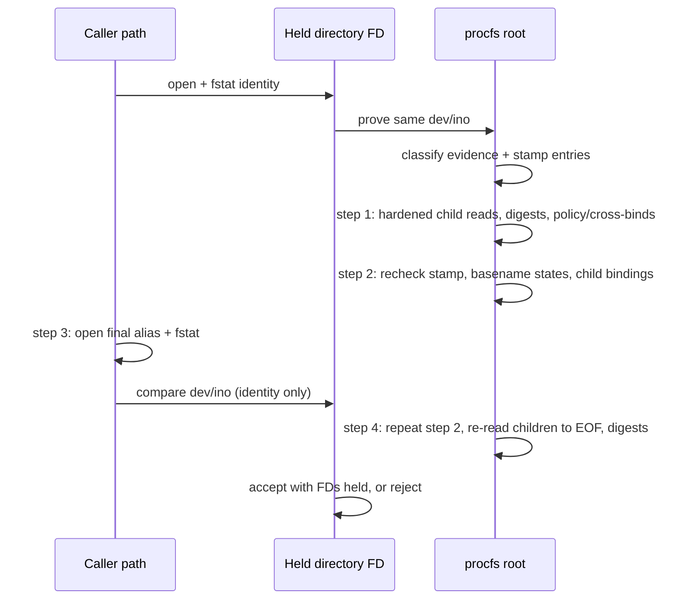

# Design: Pin Private Diagnostics Directory on Linux

## Technical Approach

Replace P2 pathname authority with one held Linux directory FD. Discovery, classification, five-file legacy snapshots, evidence pair, archive, receipt, and verification reads use `/proc/self/fd/<fd>/<safe-basename>`. The FD pins directory identity, **not** bundle contents; alias validation proves identity only; anchored rechecks before and after it, plus a final content re-read, complete acceptance. P1 policy, clock, cross-binding, unsigned result, grammar, and declarative custody remain.

## Architecture Decisions and Invariants

| Decision | Choice and rationale |
|---|---|
| Capability | Evidence requires Linux, required constants, and procfs. Node documents pathname `openSync`, descriptor `fstatSync`, and reads, but no portable `openat`/`fstatat` or descendant-relative `fs.Dir`/`FileHandle` open [N1][N2]. |
| Acquire/prove | Reject a final symlink; canonicalize the absolute input; open `O_RDONLY\|O_DIRECTORY\|O_NOFOLLOW\|O_NONBLOCK`; require `fstatSync(fd,{bigint:true}).isDirectory()`. Before children, `statSync(/proc/self/fd/<fd>,{bigint:true})` must match descriptor `dev`/`ino` [L1]. Hold the FD through acceptance; close in `finally`. |
| Entry stability | Capture directory stamp `{dev,ino,size,mtimeNs,ctimeNs}` plus each evidence basename's absent-or-metadata state before/after classification and at steps 2 and 4. A basename recorded absent must still be absent: its `ENOENT` is the expected state, not a failure. Differences—including same-A add/remove/ABA—are `V_RACE`. The FD alone freezes nothing. |
| Child defense | Use validated basenames only (no separators/`..`). Anchored `lstat`; open `O_RDONLY\|O_NOFOLLOW\|O_NONBLOCK`; require regular, single-link, bounded, matching pre-open `dev`/`ino`; read completely and record size and SHA-256; compare before/after `{dev,ino,size,nlink,mtimeNs,ctimeNs}` and anchored path. Retain every read child FD, including legacy five-file members, through step 4. At steps 2 and 4, each child's anchored `lstat` must equal its retained FD's `fstat` and pre-read metadata. Close all in `finally`. |
| Content binding | Metadata misses same-size writes within one timestamp tick. At step 4, after the metadata recheck, re-read each retained child FD from offset 0 to EOF; the byte count must equal the recorded size and the SHA-256 the recorded digest. |
| Linearization | (1) Static archive, content, one-clock policy, sidecar, cross-bind, and child checks. (2) Anchored recheck: directory stamp, evidence basename states, and child bindings. (3) Open caller alias with the same flags, `fstat`, compare `dev`/`ino`: identity only, never content. (4) Repeat step 2, then Content binding. Acceptance claims only: the caller path named A at step 3; recorded directory, basename, and child state held at steps 2 and 4; recorded content held at step 4. Caller-path changes after step 3 (such as ancestor renames) and mutation after step 4 are outside the claim. A→B→A never reads B. |
| Error mapping | Step 3: alias `ENOENT`, `ELOOP`, `ENOTDIR`, or `EACCES`, a non-directory, or a `dev`/`ino` mismatch is `V_DIRECTORY`. Steps 2 and 4: any state difference, an entry appearing, disappearing, or changing type (`ENOENT`, `ENOTDIR`, `ELOOP`, `EACCES` for an entry recorded present), a byte-count mismatch, or a digest mismatch is `V_RACE`. Any other errno (for example `EMFILE`, `ENFILE`, `EIO`, `ENOMEM`) propagates unclassified as today, reaching the generic CLI failure, and is never relabeled `V_DIRECTORY` or `V_RACE`. The alias FD closes in `finally`. |

## Capability and Mode Dispatch

| Environment/input | Exact outcome |
|---|---|
| Linux + proved procfs; no context; stable absent pair | Pinned legacy: exact four-argument grammar, five-file snapshot order/semantics, result, and CLI bytes. |
| Same capability; complete pair + complete context | Evidence mode with all parent rules and unsigned output. |
| Same capability; partial pair/context, pair without context, or context without pair | Evidence mode; existing `E_AUTH` incomplete input. |
| Same capability; classification changes | `V_RACE: inspection bundle changed during verification`. |
| Non-Linux or missing/restricted procfs; any context | Immediate `V_CAPABILITY: evidence verification requires Linux with usable /proc/self/fd`. |
| Unsupported; no context; path probes see complete/partial/inconsistent evidence | Same `V_CAPABILITY`; never interpret evidence. |
| Unsupported; no context; reliable before/after absence | Exact legacy. No cross-platform rename-safety claim: undetectable ABA is not called safe. |

## Verification Sequence

The original FD remains open for every post-acquisition step.

## Interfaces and File Changes

`verifyArtifact(argv, { fs?, platform?, clock?, inspectStaticArchive?, onCheckpoint? })` retains production defaults; filesystem/platform/checkpoints are deterministic test seams. An internal, never-serialized pinned-directory object owns roots, stamps, digests, FDs, and cleanup.

| File | Action |
|---|---|
| `scripts/private-local-diagnostics-verification-lib.mjs` | Add pinned reader, dispatch, modes, alias check, content binding, errors, and retained P1 rules. |
| `scripts/verify-private-local-diagnostics-artifact.test.mjs` | Add race/capability/compatibility/regression coverage. |
| Authorization/artifact libraries, wrapper, `package.json` | Unchanged contracts. |

## Test Strategy

| Matrix | Deterministic proof |
|---|---|
| Races | Checkpoints choreograph A→B→A during child reads with poisoned B and stamp change (`V_RACE`); same-A pair add/remove after classification and before step 2 (`V_RACE`); caller alias renamed away, replaced by B, or symlinked between steps 2 and 3 (`V_DIRECTORY`). With alias=A, each injected between step 1's last content check and step 3, and between steps 3 and 4: in-place child write, same-size write with timestamps frozen through the `fs` seam, child replacement by rename with an unchanged directory stamp, and pair add/remove, each `V_RACE`. An append between the step-4 metadata recheck and re-read is `V_RACE`. An ancestor rename between steps 3 and 4 leaves the result unchanged. Mutations before a child's step-1 read are input, not races. Prove B is never consumed. |
| Classification | Complete/partial/absent evidence and context, including a recorded-absent pair staying legacy through steps 2 and 4; non-Linux; missing procfs/`EACCES`; inconsistent probes. |
| Compatibility | Exact legacy snapshot/order/result/CLI bytes; exact evidence output; one clock. |
| Regression | FIFO, symlink, hardlink, replacement, mutation, short read, archive non-execution, cross-binds, replay/time/storage, `EMFILE`/`EIO` staying unclassified, and FD closure on every exit. |

## Failure, Operations, and Rollback

New stable classes: `V_CAPABILITY`, `V_DIRECTORY: artifact directory is unsafe`, and `V_RACE`; existing classes remain. Messages expose no path, FD, proc path, metadata, or digest; CLI stderr stays generic. Emit no new telemetry. Rollback reverts replacement P2, retains P1, and blocks P3. Superseding/closing PR #25 needs separate authorization.

## Alternatives Rejected

Endpoint metadata/retry misses ABA; copy captures attacker-selected state; locks require cooperation. `fs.Dir` scans and `FileHandle` addresses itself, not descriptor-relative descendants [N2]. Native `openat2` helpers add build/deployment trust. Explicit-mode CLI breaks frozen grammar.

## Scope, Forecast, and Assumptions

No producer/signing/trust/custody/network/host-path/P3/build/pack/rollout change. Forecast: verifier **210–275** plus tests **240–320** lines (**450–595**): high 400-line risk. Use stacked-to-main units: (1) pinned primitives/capability/races; (2) mode/evidence integration and compatibility/regressions. No exception. This design exceeds the 800-word guide by maintainer decision, to keep contract qualifiers exact.

1. **ASSUMPTION:** procfs/kernel descriptor metadata are trusted after proof.
2. **ASSUMPTION:** the actor cannot alter this process's FDs or forge kernel inode/version metadata.
3. **ASSUMPTION:** Node stays within the repository's `>=20` contract.

Sources (checked 2026-09-14): [N1] Node.js v22.20.0 fs/flags, https://nodejs.org/docs/latest-v22.x/api/fs.html; [N2] its `FileHandle`/`fs.Dir` sections; [L1] Linux `proc_pid_fd(5)`, https://man7.org/linux/man-pages/man5/proc_pid_fd.5.html.

## Open Questions

None.
